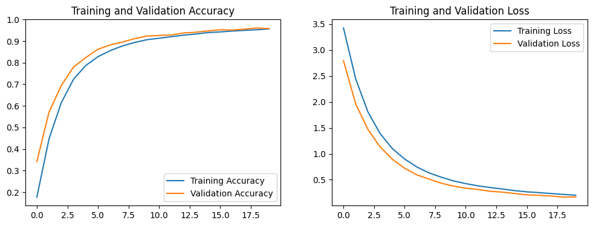
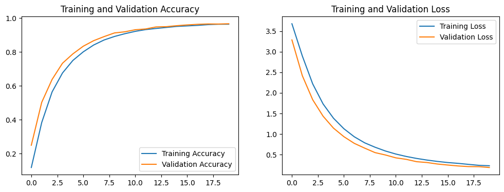
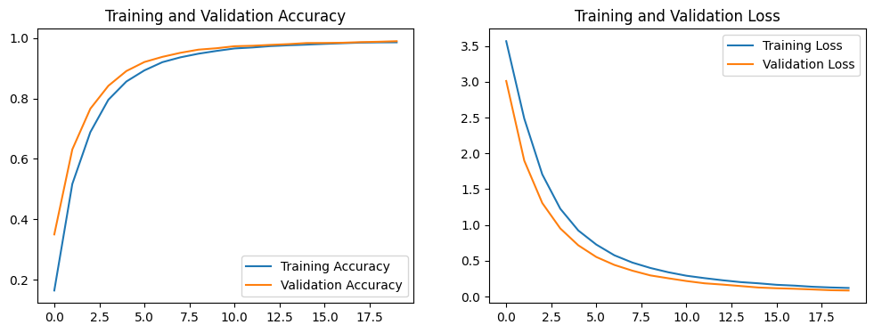

# Resumo

A pecuária desempenha um papel significativo na economia brasileira, destacando-se como o maior rebanho bovino do mundo e líder mundial nas exportações de carne bovina. Diante da importância do setor, a implementação de novas tecnologias que suportem técnicas utilizadas, como a rastreabilidade do gado, é crucial para uma gestão mais eficiente. O reconhecimento de bovinos em imagens por meio de avanços em Inteligência Artificial, particularmente Redes Neurais Convolucionais (CNNs), surge como uma solução inovadora e não invasiva. Este estudo propõe avaliar o emprego de CNNs na identificação de bovinos utilizando um conjunto de imagens da raça Pantaneira. A pesquisa adota uma arquitetura baseada na DenseNet, incorporando técnicas de transferência de aprendizado para a classificação dos animais. Experimentos iterativos foram conduzidos, incluindo a seleção e recorte criteriosos do conjunto de dados, visando otimizar o desempenho da rede. A aplicação dessas abordagens permitiu alcançar resultados similares ao estado da arte. Espera-se que este trabalho não apenas contribua para a compreensão da eficácia das CNNs na raça Pantaneira, mas também sugira sua extensibilidade para análises em diversas raças, ampliando assim sua aplicabilidade e relevância.

# Conjunto de dados

Para o treinamento do modelo proposto para reconhecimento de bovinos, foi utilizado o dataset RecBov51c, encontrado em:

https://data.mendeley.com/datasets/8ysxtyf8p2/1

# Experimentos

Os experimentos propostos visam treinar o modelo de CNN utilizando o conjunto de dados RecBov51c em três diferentes etapas e avaliar o desempenho alcançado para cada experimento, a partir da análise de métricas obtidas no treinamento do modelo.

| Experimento | Descrição | Quantidade de imagens no *dataset* | Quantidade de classes |
|-------------|-----------|-------------------------------------|------------------------|
| E1a         | Treinamento do modelo utilizando o *dataset* original | 28.025 | 50 |
| E1b         | Treinamento do modelo utilizando o *dataset* original após a remoção da classe duplicada 51 | 27.524 | 49 |
| E2          | Treinamento do modelo com imagens do *dataset* selecionadas, excluindo imagens indesejadas para o treinamento e a classe 51 | 10.967 | 49 |
| E3          | Treinamento do modelo com imagens do *dataset* selecionadas e cortadas em *aspect ratio* 1:1 sem a classe 51 | 10.967 | 49 |

# Resultados

### Experimento E1b

### Experimento E2

### Experimento E3

# Veja mais

Trabalho de Conclusão completo em https://bdm.unb.br/handle/10483/38456
